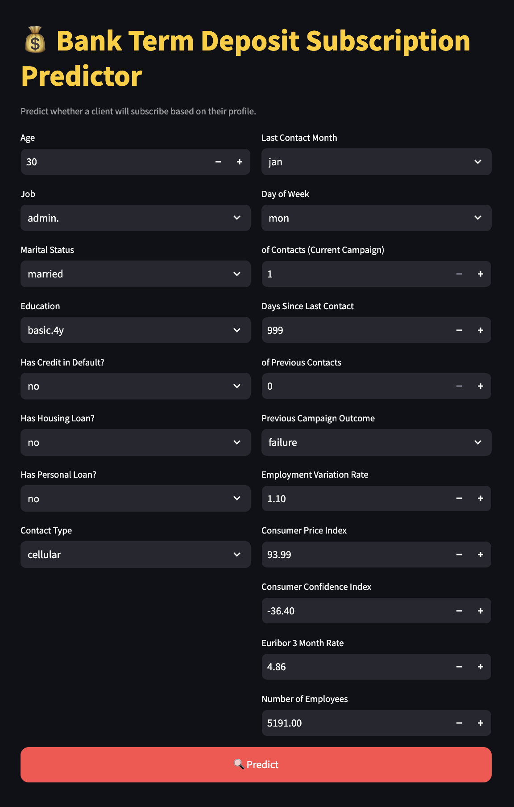

# 💰 Bank Term Deposit Subscription Predictor

A machine learning web app built with **XGBoost** and **Streamlit** that predicts whether a customer will subscribe to a term deposit based on their demographic and behavioral information. This project is based on the Bank Marketing dataset from the [UCI Machine Learning Repository](https://archive.ics.uci.edu/ml/datasets/Bank+Marketing).

---

## 📌 Project Highlights

- ✅ Trained a high-performing **XGBoost** model
- 🧹 Performed **label encoding** and handled **class imbalance**
- 🧪 Achieved **87.5% accuracy** and **48% recall** for positive class (subscribers)
- 🖥️ Deployed using **Streamlit** with a clean, modern UI
- 📈 Displayed prediction confidence and model insights for better understanding

---

## 📊 Dataset Overview

- 20 input features including:
  - Demographics: `age`, `job`, `marital`, `education`
  - Finance: `default`, `housing`, `loan`
  - Campaign: `contact`, `month`, `day_of_week`, `campaign`, `previous`, `pdays`, `poutcome`
  - Economic indicators: `emp.var.rate`, `cons.price.idx`, `cons.conf.idx`, `euribor3m`, `nr.employed`
- Target: `y` → whether the client subscribed (`yes` or `no`)

---

## 🚀 How to Run Locally

1. Clone this repository:
```bash
git clone https://github.com/gnanreddy11/PRODIGY_DS_03.git
cd PRODIGY_DS_03
```

2. Install dependencies:
```bash
pip install -r requirements.txt
```

3. Run the Streamlit app:
```bash
streamlit run app.py
```

---

## 🖼️ App UI

| Input Form | Prediction Output |
|------------|-------------------|
|  | ✅ or ❌ prediction with confidence % |

---

## 📚 Key Learnings

- Importance of class imbalance handling (used `scale_pos_weight`)
- Effective use of **label encoding** for categorical variables
- Deployment using Streamlit and organizing UI for better UX
- Communicating model results with confidence scores and metric explanations

---

## 📌 Tools & Libraries

- Python
- Pandas, NumPy
- XGBoost
- scikit-learn
- Streamlit
- joblib
